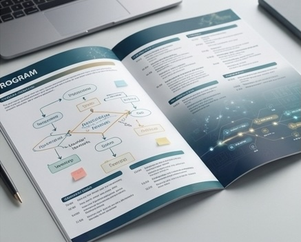

<h1>2026 AAGI Symposium</h1>

        Connecting people, data and innovation for Australia's grains industry

  10–12 November 2026 • Perth, Western Australia

---

# 2026 AAGI Symposium

**10–12 November 2026**

**QT Hotel Perth • 133 Murray Street • Perth CBD**

--- 

Welcome to the official website of the **2026 Australian Analytics for the Australian Grains Industry (AAGI) Symposium**.

The annual AAGI Symposium brings together researchers, students and industry collaborators from across Australia to share research, develop new collaborations, and explore the latest advances in data analytics for the grains industry. The symposium provides an opportunity to showcase innovative research, exchange ideas, learn new tools and methods, and strengthen the AAGI community. This year's program also includes the inaugural AAGI Awards, recognising outstanding contributions from AAGI members.

## Explore the Symposium

This website is your central hub before, during and after the symposium.

<!-- 
### 📅  Program
Browse the full symposium schedule, including keynote presentations, research talks, workshops, poster sessions, networking events and social activities.

### 🛠  Workshops
Access workshop descriptions, presentation slides, code, datasets and supporting resources.

### 📌  Poster Showcase
Explore digital versions of posters presented during the symposium and connect with presenters.

### 🎓  HDR Networking
Find information and resources for the Higher Degree by Research networking session, including mentoring and career development activities.

### 👥  Participants
Meet the researchers, students and collaborators who make up the AAGI community.

### 📚  Resources
Access additional symposium materials, links and downloads shared throughout the event. -->

<a class="nav-card" href="program.qmd">

<h3>Program</h3>

View the symposium schedule, including research talks, workshops, poster sessions, networking events and social activities.

</a>
<a class="nav-card" href="workshops.qmd">

<h3>Workshops</h3>

Access workshop descriptions, presentation slides, code, datasets and supporting resources.

</a>
<a class="nav-card" href="posters.qmd">

<h3>Poster Showcase</h3>

Explore digital versions of posters presented during the symposium and connect with presenters.

</a>
<a class="nav-card" href="hdr.qmd">

<h3>HDR Networking</h3>

Find information and resources for the Higher Degree by Research Networking Session, including mentoring and career development activities.

</a>
<a class="nav-card" href="participants.qmd">

<h3>Participants</h3>

Meet the researchers, students and collaborators who make up the AAGI community.

</a>
<a class="nav-card" href="resources.qmd">

<h3>Resources</h3>

Access additional symposium materials, links and downloads shared throughout the event.

</a> 

## Symposium Goals

The AAGI Symposium aims to:

* showcase innovative research from AAGI groups across Australia;
* share practical tools, methods and workflows for grains analytics;
* foster collaboration between researchers, students and industry partners;
* support professional development through workshops and networking; and
* strengthen the national AAGI research community.

Whether you are attending in person or revisiting the symposium afterwards, we hope this website provides a useful resource and helps continue the conversations beyond the event.

We look forward to welcoming you to Perth in November 2026.

<!-- We hope this website continues to serve as a valuable resource long after the symposium concludes. Whether you're attending in person or revisiting presentations and workshop materials, welcome to the 2026 AAGI Symposium. -->

<!-- 
Welcome to the 2026 AAGI Symposium

Welcome to the official website of the 2026 Australian Analytics for the Australian Grains Industry (AAGI) Symposium, taking place in Perth, Western Australia, from 10–12 November 2026.

The annual AAGI Symposium brings together researchers, students and industry collaborators from across Australia to share research, develop new collaborations, and explore the latest advances in data analytics for the grains industry. The symposium provides an opportunity to showcase innovative research, exchange ideas, learn new tools and methods, and strengthen the AAGI community. This year's program also includes the inaugural AAGI Awards, recognising outstanding contributions from AAGI members.

About this website

This website serves as the central hub for the symposium. Here you will find:

- Program – the full symposium schedule, including talks, workshops, poster sessions and social events.
- Workshops – workshop descriptions, slides, notebooks, datasets and other supporting material.
- Poster Showcase – digital versions of symposium posters, available throughout and after the event.
- HDR Networking Session – information and resources for Higher Degree by Research students.
- Participants – symposium attendees and contributors.
- Resources – links, downloads and other materials shared during the symposium.

Additional content will be added as it becomes available.

Our Goals

The AAGI Symposium aims to:

- showcase research and innovation from AAGI groups across Australia;
- share practical tools, methods and workflows for grains analytics;
- foster collaboration between researchers, students and industry partners;
- support professional development through workshops and networking; and
- strengthen the national AAGI research community.

Whether you are attending in person or revisiting the symposium afterwards, we hope this website provides a useful resource and helps continue the conversations beyond the event.

We look forward to welcoming you to Perth in November 2026. -->
